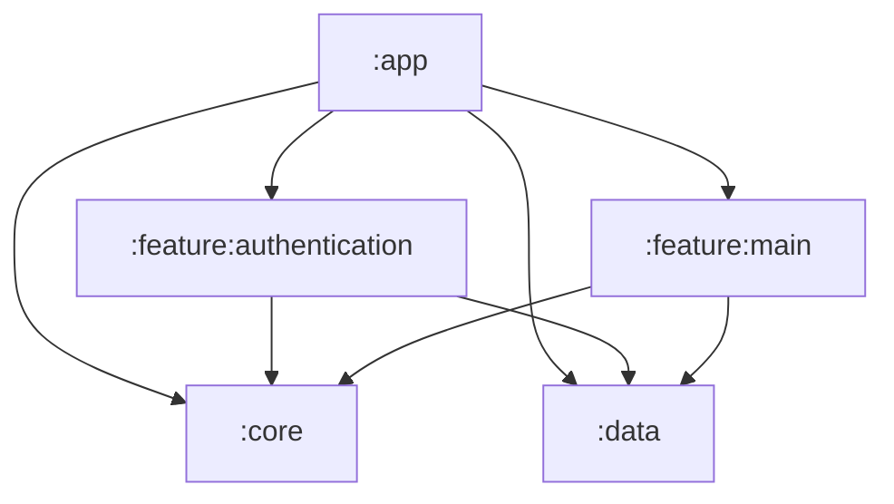

# Module boundaries

The application uses five Gradle modules. The existing ViewModels, StateFlow,
repositories, use cases, and Koin architecture are preserved. Library packages now
follow their module and layer; see [the package architecture audit](ARCHITECTURE.md).

| Module | Responsibility |
| --- | --- |
| `:app` | Application startup, activities, navigation between features, server URL, app version, flavors, signing, and ADB run tasks. |
| `:core` | Compose design system, shared UI, BaseViewModel, async/screen state, formatting and deep-link utilities. |
| `:data` | Repository APIs, friends polling/cache, credential and location persistence, internal network/Room sources, device ID, session operations, and their Koin bindings. |
| `:feature:authentication` | Splash, login, sign-up, credential remembrance, validation, and authentication ViewModels. |
| `:feature:main` | Map, friends, settings, location service, proximity notifications, NFC, and their ViewModels/use cases. |

## Rules for future changes

- Features depend on core and data, never on each other or app.
- Core and data are independent. Data does not depend on Compose or presentation.
- App-specific navigation is passed as callbacks. The location service receives a
  `MainActivityIntentFactory` from app for its notification intents.
- The app passes `BuildConfig.BASE_URL` to `networkModule(baseUrl)` and its version
  name to the settings screen. Libraries have no product flavors or app BuildConfig.
- Resources live with their feature; shared branding and UI resources live in core.
  Non-transitive R classes remain enabled. Use an explicit core R alias when needed.
- Prefer `implementation` dependencies. Use `api` only for types exposed in public
  signatures, such as Compose UI types, Flow, Retrofit responses, and RoomDatabase.
- Keep data sources and implementation details internal. Features access storage
  through repositories; navigation route types and immutable models form small
  public module boundaries.

Map, friends, and settings stay together because they share location state and
services. Networking and storage stay together because they serve the same app
data. Add another module when a concrete ownership, reuse, or dependency boundary
justifies it. This split introduces no extra architecture layer or external library.

## Tests and builds

Tests live beside the module they exercise. Core's test fixtures expose the existing
`MainDispatcherRule` to the other modules without another test utility module.
Instrumented Room tests live in data; Compose friends tests live in feature main.
App keeps its application context and production logging tests.

Run `./gradlew test lint assembleDebug` from the root. Tests include all modules and
all three debug app flavors; app retains all six flavor/build type combinations.
Existing ADB profiles still use the app's `run<Variant>` tasks. Use `:app:assembleProductionRelease` and
`:app:assembleProductionPremiumRelease` to check signed, optimized production APKs.

The split follows the
[Android modularization guidance](https://developer.android.com/topic/modularization/patterns)
while keeping the number of modules proportional to the size of this app.
